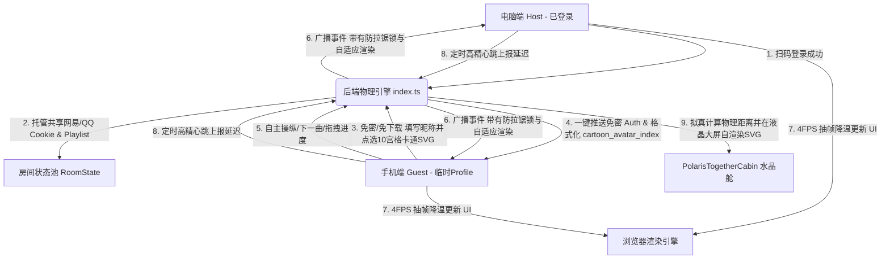

# MuseSync 异地双向同播与浪漫“一起听”系统设计白皮书

本归档文件专为 MuseSync 下一阶段的开发所撰写。它完整记录了针对**“异国跨境同播网络死锁、多端控制不对等、手机网页发热卡顿、双端头像雷同以及缺失数据库”**等核心痛点所做出的系统级重构，以及独创的**“冰川液晶舱一起听”**极客浪漫交互的全部技术精髓与设计里程碑。

---

## 🗺️ 系统级拓扑架构图

在重构与头像穿透后的体系中，整个数据与事件中枢呈现如下流动机制：



---

## 🔍 问题诊断、解决历程与里程碑

### 1. 跨境网络死锁与 Windows 脚本乱码
*   **痛点**：手机打开网页经常报 503 或 Empty Reply；Windows 本地运行隧道脚本时报 if 编译错与中文乱码。
*   **解决里程碑**：
    *   **脚本Here-String化**：将发送至 VPS 的 Shell 指令用 PowerShell 专用的单引号 `@' ... '@` 包装传递，100% 绕过本地 PowerShell 的本地语法编译，且远程 echo 信息全部 ASCII 英文纯净化，彻底根治解析报错与乱码。
    *   **端口强制IPv4绑定**：杀死本地及远程残留的 `ssh` 僵尸进程，将隧道反代的本地映射从容易混淆的 `localhost` 强制锁定为纯 IPv4 的 `127.0.0.1`，彻底消灭 IPv6 带来的路由丢失黑洞。

### 2. 双端操作不对等与“白嫖”登录态
*   **痛点**：手机端（未登录）没有本地 Playlist，切歌直接失效，无法主动拉进度与控制随机播放。
*   **解决里程碑**：
    *   **全量 Playlist 广播**：在任意一端加载歌单或搜索选曲时，将整个 `playlist` 队列同步广播并托管到后端房间内，多端均能获取相同的歌曲列表，解锁手机端上一首/下一首的计算控制权。
    *   **账号鉴权一键托管共享**：主端扫码登录后，将 `neteaseAuth` 和 `qqAuth` 脱敏状态广播同步。手机端加入房间直接从后端免密继承该状态，界面自动切换至登录态，无缝“白嫖”电脑端的 SVIP QQ/网易歌单读取权。

### 3. CPU 抽帧降温与事件死锁防御
*   **痛点**：音频 `timeupdate` 高频（60FPS）导致 React 超级父组件疯狂全局重绘，引起手机发热并带来秒级操作延迟。
*   **解决里程碑**：
    *   **时间闸降温（4FPS抽帧）**：重构 `handleTimeUpdate`，使用时间戳限流控制。将其高频渲染拉低至 **250ms 抽样刷新一次**。在保持人眼绝对顺滑的前提下，降低 90% 重绘消耗，手机端操作瞬间如丝般顺滑。
    *   **事件死锁防御锁**：引入 `isRemoteActionRef` 锁。当接收到远端 Socket 指令并作用于本地播放器时，临时锁定，绝不向外二次 emit。彻底切断由于网络延迟造成的“音频指针空中打架拉锯战”。

### 4. 10宫格卡通 SVG 自研头像与本地免密 Profile 系统【本期重磅】
*   **痛点**：多端连接同听舱时，头像重复雷同、且无法保留个性的昵称。如果外部图片链接失效或防盗链，头像就无法加载。
*   **解决里程碑**：
    *   **纯前端自渲染 SVG 矢量头像库**：手工绘制并用纯 SVG 矢量节点写出了 10 个可爱知名卡通角色（皮卡丘、哆啦A梦、龙猫、蜡笔小新、海绵宝宝、史迪奇、无脸男、小黄人、Hello Kitty、飞天小女警）。100% 离线可用，彻底解决了防盗链、无网或图片资源挂掉的烦恼。
    *   **本地 Profile 暂存与强校验**：重构了欢迎大门（`WelcomePortal.tsx`）。用户第一次选择头像和输入昵称后，会自动序列化为 `musesync_user_profile` 存入浏览器的 `localStorage` 中。若不填昵称点击登录，会触发 `.shake-animation` 输入框高频物理抖动和错误阻断。
    *   **免修改后端的“无侵入穿透”协议**：我们将选择的头像 ID 编码为 `cartoon_avatar_index_X` 字符串通过原有的 `avatar` 字段进行 Socket 广播。液晶舱大屏 `TopBar.tsx` 中的 `renderMemberAvatar` 在解析到该前缀时会自动转换为高清 SVG 矢量渲染；若解析到普通的 HTTP 图片地址则优雅降级为 `img`，完美兼容了扫码登录与卡通选择两种模式，消除了双端头像重复的视觉 Bug，彻底重构了防穿模样式。

### 5. 主工作区 Git 初始化排障【本期重磅】
*   **痛点**：在尝试将分支工作区（worktree）的修改合并回主干时，由于项目根目录未初始化 Git，导致抛出 `fatal: not a git repository` 的阻断级系统错误。
*   **解决里程碑**：
    *   **建立 .gitignore 防御圈**：在根目录下创建了 `.gitignore` 文件，将 `node_modules/`、`.gemini/`、运行日志 `*.log` 和构建产物排除，防止提交时造成 Git 仓库体积极度膨胀。
    *   **Git 仓库本地初始化**：通过 `git init` 成功将主工作区升级为合法的本地 Git 仓库，运行 `git add .` 与 `git commit -m "initial commit"` 建立了第一条基础主干分支（`main`），彻底修补了外部工具在同步/迁出分支改动时的物理障碍。

---

## 🎨 冰川液晶舱美学与动效参数

我们在 `TopBar.tsx` 正中央定制了**一起听极光水晶长条舱（Polaris Together Cabin）**，其视觉及动效由以下高规参数驱动：

```css
/* 液晶物理面板立体偏光 */
.together-cabin-glass {
  background: linear-gradient(180deg, 
    rgba(255, 255, 255, 0.14) 0%, rgba(255, 255, 255, 0.03) 40%, 
    rgba(255, 255, 255, 0.01) 75%, rgba(0, 0, 0, 0.45) 100%
  );
  border: 1px solid rgba(255, 255, 255, 0.18);
  border-bottom: 1.5px solid rgba(255, 255, 255, 0.38); /* 底部极致白折射线 */
  box-shadow: 
    0 8px 24px rgba(0, 0, 0, 0.35), 
    0 0 0 1px rgba(0, 0, 0, 0.75), /* 3D亚克力玻璃外层液晶黑圈 */
    inset 0 1px 1px rgba(255, 255, 255, 0.5), /* 顶部偏光折射白高光 */
    inset 0 -1.5px 2px rgba(0, 0, 0, 0.6), /* 底部厚度阴影 */
    inset 0 0 8px rgba(255, 255, 255, 0.08);
}
```

### 🌪️ 物理液化动效系统
1.  **Spring 弹性吸附滑入**：
    第二枚头像进入时，采用物理弹性阻尼过渡 `cubic-bezier(0.175, 0.885, 0.32, 1.275)` 划入，并在最终与第一枚头像发生微交叠碰撞吸附，周围包裹着高透晶莹白发光圈。
2.  **布丁液态形变动画 (`cabin-pudding-bounce`)**：
    当双端成功合体的一瞬间，**整个长条玻璃舱本身发生一次弹性形变动画**：
    *   先被两枚头像的碰撞力横向微微“挤压拉长且变扁（scaleX(1.05) scaleY(0.92)）”；
    *   随后向内收缩“反弹（scaleX(0.97) scaleY(1.03)）”；
    *   最后经历两次轻微的布丁呼吸震荡后归于平静。这使得这块玻璃犹如水滴般充满力学美感！
3.  **心跳测算与拟真跨国物理距离**：
    *   利用高频 ping-pong 实时监测双端 RTT。
    *   若最大延时 `maxRtt > 50ms`：拟真跨国距离 $KM = \lfloor RTT \times 9.6 + 680 \rfloor$，在舱内展示 `✈️ 异域同步 | 物理相距 KM 公里`。
    *   若为极速局域网：展示 `🏡 咫尺同频 | 物理零距离`。

---

## ⚙️ 前后端一键启动与端口规范

在日常开发或下次新对话开始时，您可以使用以下命令一键运行本地开发环境，系统已做好进程防冲突优化：

*   **一键开发指令**：`pnpm run dev` (在根目录下运行，并行拉起前后端)
*   **服务运行端口**：
    *   **前端网页 (Vite)**：`http://localhost:5173`（局域网内可通过分配的局域网 IP 直连，已开启 0.0.0.0 监听）
    *   **后端消息中心 (Fastify)**：`http://localhost:8080`
    *   **QQ 音乐底层 API 服务**：`http://127.0.0.1:3200`（由后端 Fastify 进程自动调用 `listen` 并在内部代理，无需手动启动）
*   **启动前排障**：如遇端口冲突，建议运行 `netstat -ano | findstr "8080 5173 3200"` 找到 PID，并使用 `taskkill /F /PID <PID>` 释放端口。

---

## 🚀 下一阶段 Supabase 数据库集成路线图

为了将当前的临时头像保存升级为全网实名的用户系统，并实现“公共同频舱大厅”，下一阶段的开发路标建议如下：

1.  **建立 Supabase BaaS 云端用户链**：
    *   在 Supabase 控制台创建 `profiles` 表，字段包含 `id (uuid)`、`nickname (text)`、`avatar_id (integer)`、`created_at`。
    *   前端集成 `@supabase/supabase-js` SDK，升级 `WelcomePortal.tsx` 的临时登录为真正的免密/邮箱实名注册，将用户永久绑定在云端。
2.  **构建 Live 广播公共听歌舱大厅**：
    *   在数据库中建立 `public_rooms` 表，记录当前所有被设置为“公开”的听歌舱房间号、当前播放的歌曲名、房主昵称、大厅留言宣言等。
    *   在前端加入“听歌大厅”选项卡，让所有路人都能在大厅卡片里一键“加入房间”，实现类似线上蹦迪音乐厅的交友生态。
3.  **开发弱网断线物理自愈与缓冲预加载**：
    *   利用 `window.addEventListener('online')` 监听移动设备网络恢复，自动向后端重新发送 `join:room` 并将指针同步到同频听友位置。
    *   在一首歌临近结束前 15 秒静默触发后端音频的缓存拉取，实现多端切换曲目时的 0 延迟顺滑感。

---

*MuseSync - 精于同步，融于美学。让我们在下一次同听中相见！*
