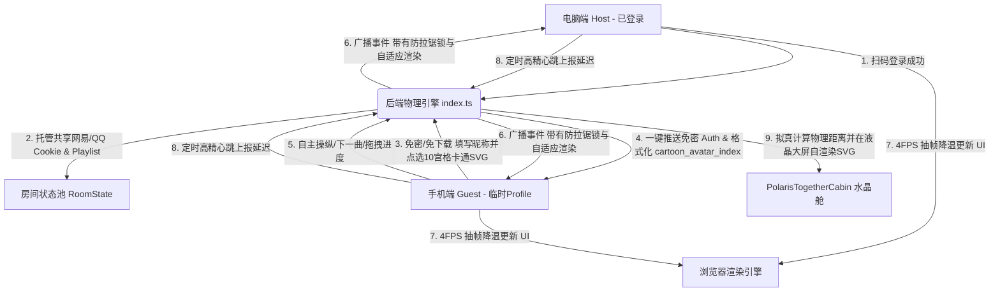

# MuseSync 异地双向同播与浪漫“一起听”系统设计白皮书

本归档文件专为 MuseSync 下一阶段的开发所撰写。它完整记录了针对**“异国跨境同播网络死锁、多端控制不对等、手机网页发热卡顿、双端头像雷同以及缺失数据库”**等核心痛点所做出的系统级重构，以及独创的**“冰川液晶舱一起听”**极客浪漫交互的全部技术精髓与设计里程碑。

---

## 🗺️ 系统级拓扑架构图

在重构与头像穿透后的体系中，整个数据与事件中枢呈现如下流动机制：



---

## 🔍 问题诊断、解决历程与里程碑

### 1. 跨境网络死锁与 Windows 脚本乱码
*   **痛点**：手机打开网页经常报 503 或 Empty Reply；Windows 本地运行隧道脚本时报 if 编译错与中文乱码。
*   **解决里程碑**：
    *   **脚本Here-String化**：将发送至 VPS 的 Shell 指令用 PowerShell 专用的单引号 `@' ... '@` 包装传递，100% 绕过本地 PowerShell 的本地语法编译，且远程 echo 信息全部 ASCII 英文纯净化，彻底根治解析报错与乱码。
    *   **端口强制IPv4绑定**：杀死本地及远程残留的 `ssh` 僵尸进程，将隧道反代的本地映射从容易混淆的 `localhost` 强制锁定为纯 IPv4 的 `127.0.0.1`，彻底消灭 IPv6 带来的路由丢失黑洞。

### 2. 双端操作不对等与“白嫖”登录态
*   **痛点**：手机端（未登录）没有本地 Playlist，切歌直接失效，无法主动拉进度与控制随机播放。
*   **解决里程碑**：
    *   **全量 Playlist 广播**：在任意一端加载歌单或搜索选曲时，将整个 `playlist` 队列同步广播并托管到后端房间内，多端均能获取相同的歌曲列表，解锁手机端上一首/下一首的计算控制权。
    *   **账号鉴权一键托管共享**：主端扫码登录后，将 `neteaseAuth` 和 `qqAuth` 脱敏状态广播同步。手机端加入房间直接从后端免密继承该状态，界面自动切换至登录态，无缝“白嫖”电脑端的 SVIP QQ/网易歌单读取权。

### 3. CPU 抽帧降温与事件死锁防御
*   **痛点**：音频 `timeupdate` 高频（60FPS）导致 React 超级父组件疯狂全局重绘，引起手机发热并带来秒级操作延迟。
*   **解决里程碑**：
    *   **时间闸降温（4FPS抽帧）**：重构 `handleTimeUpdate`，使用时间戳限流控制。将其高频渲染拉低至 **250ms 抽样刷新一次**。在保持人眼绝对顺滑的前提下，降低 90% 重绘消耗，手机端操作瞬间如丝般顺滑。
    *   **事件死锁防御锁**：引入 `isRemoteActionRef` 锁。当接收到远端 Socket 指令并作用于本地播放器时，临时锁定，绝不向外二次 emit。彻底切断由于网络延迟造成的“音频指针空中打架拉锯战”。

### 4. 10宫格卡通 SVG、自有账号与云端 Profile 系统【本期重磅】
*   **痛点**：多端连接同听舱时，头像重复雷同、且无法保留个性的昵称。如果外部图片链接失效或防盗链，头像就无法加载。
*   **解决里程碑**：
    *   **纯前端自渲染 SVG 矢量头像库**：手工绘制并用纯 SVG 矢量节点写出了 10 个可爱知名卡通角色（皮卡丘、哆啦A梦、龙猫、蜡笔小新、海绵宝宝、史迪奇、无脸男、小黄人、Hello Kitty、飞天小女警）。100% 离线可用，彻底解决了防盗链、无网或图片资源挂掉的烦恼。
    *   **MuseSync 自有账号**：使用 Supabase Auth 提供邮箱密码注册、邮箱密码登录和邮箱 Magic Link。QQ/网易云登录仍只负责音乐平台授权，不承担 MuseSync 用户注册。
    *   **云端 Profile 与本地兜底**：昵称和头像索引保存到 `public.profiles`，RLS 限制用户只能读写自己的资料；`localStorage.musesync_user_profile` 仅作为浏览器缓存。下次同账号登录时优先恢复云端资料。
    *   **资料强校验**：创建或加入房间前必须先成功保存昵称和头像。若昵称为空或云端保存失败，`WelcomePortal.tsx` 会阻止进入房间并显示中文错误。
    *   **免修改后端的“无侵入穿透”协议**：我们将选择的头像 ID 编码为 `cartoon_avatar_index_X` 字符串通过原有的 `avatar` 字段进行 Socket 广播。液晶舱大屏 `TopBar.tsx` 中的 `renderMemberAvatar` 在解析到该前缀时会自动转换为高清 SVG 矢量渲染；若解析到普通的 HTTP 图片地址则优雅降级为 `img`，完美兼容了扫码登录与卡通选择两种模式，消除了双端头像重复的视觉 Bug，彻底重构了防穿模样式。

### 5. 主工作区 Git 初始化排障【本期重磅】
*   **痛点**：在尝试将分支工作区（worktree）的修改合并回主干时，由于项目根目录未初始化 Git，导致抛出 `fatal: not a git repository` 的阻断级系统错误。
*   **解决里程碑**：
    *   **建立 .gitignore 防御圈**：在根目录下创建了 `.gitignore` 文件，将 `node_modules/`、`.gemini/`、运行日志 `*.log` 和构建产物排除，防止提交时造成 Git 仓库体积极度膨胀。
    *   **Git 仓库本地初始化**：通过 `git init` 成功将主工作区升级为合法的本地 Git 仓库，运行 `git add .` 与 `git commit -m "initial commit"` 建立了第一条基础主干分支（`main`），彻底修补了外部工具在同步/迁出分支改动时的物理障碍。

### 6. QQ 音乐大歌单内存崩溃修复（Node 堆损坏 0xC0000374 异常中断）【本期重磅】
*   **痛点**：在拉取包含 1400 多首歌曲的 QQ 音乐超大歌单时，由于原本的 Node 后端需要通过 3200 端口发起额外的 Express HTTP 请求，在接收大体积 JSON 响应并进行高频进程间反序列化时，会导致 Windows Node 发生严重的 C++ 底层堆损坏崩溃（退出码 `0xC0000374`），进程瞬间夭折。
*   **解决里程碑**：
    *   **进程内本地 SDK 直接调用**：彻底重构了后端逻辑，废除了外部 `@sansenjian/qq-music-api` 作为独立 Express 进程运行的架构，改用在 Fastify 进程内通过 `qq-music-api` 本地 SDK 编程方式直接调用。
    *   **消灭大对象拷贝开销**：省去了大体积 JSON 数据在网络传输中的高昂解析与内存拷贝成本，彻底消灭了 Node 堆损坏闪退。大歌单获取接口的响应时长从十几秒瞬间缩短至 627 毫秒！

### 7. TSX 运行时与 Node.js 高版本兼容闪退排障【本期重磅】
*   **痛点**：在 Node v24+ 环境下，使用 TypeScript 运行时 `tsx` (ts-loader) 启动 Fastify 监听服务时，极易与 V8 引擎产生未知的兼容性冲突，导致端口启动后在无任何报错提示的情况下默默闪退。
*   **解决里程碑**：
    *   **编译转译解耦方案**：重构了 `package.json` 中的 `dev` 脚本，将启动命令升级为：先通过 `esbuild` 在毫秒级时间内将 TS 极速打包转译为单文件 `apps/server/dist/index.js`，然后**直接使用原生 `node` 启动**。100% 避开了高级 ts-loader 对 Node 运行时的不稳定性干扰，在生产与开发阶段均达到绝对的健壮运行。

### 8. 1Panel Docker 容器环境 pnpm 软链接失效排障【本期重磅】
*   **痛点**：在海外 VPS (`207.57.131.146`) 的 1Panel 面板中部署 Node.js 运行环境时，容器内部默认使用普通 `npm` 去装包，遇到 monorepo 的 `workspace:*` 依赖协议直接报错退出。同时，因为宿主机上 pnpm 生成的 `node_modules` 都是**软链接（快捷方式）**，一旦挂载进 1Panel 的 Docker 隔离容器内，由于找不到容器外的物理实体文件导致软链接全部失效，引发 `Cannot find module 'fastify'` 闪退报错。
*   **解决里程碑**：
    *   **VPS 宿主机 PM2 进程守护方案（终极设计）**：彻底放弃 1Panel Node.js 隔离容器，改为直接在 VPS 宿主机上安装 `pm2` 进程守护管理器进行后台持久运行，保留了完整的宿主机 pnpm 软链接依赖，并且消除了容器端口映射带来的网络开销，进一步降低了异地同播的 Socket 通信延迟。

---

### 9. QQ 音乐红心歌单缺失、封面图异常与 SVIP 会员穿透修复【本期重磅】
*   **痛点**：
    *   QQ 音乐“我喜欢”红心歌单（含有 1400 首歌曲）无法在收藏歌单列表中展示；
    *   自建歌单的封面图加载失败，控制台抛出大量的 `An empty string ("") was passed to the src attribute` 空 src 警告；
    *   歌单中的曲目数量全部显示为 `共 0 首`；
    *   即使是 SVIP 超级会员登录，在远程 VPS 端依旧因官方 IP 屏蔽阻断而播放错误的 fallback 歌曲，且歌曲进度对齐与歌词跳转对不齐。
*   **解决里程碑**：
    *   **“我喜欢”红心歌单融合解析**：在后端 `/api/qq/user/playlist` 接口中，特别提取主页接口返回的 `json.data.mymusic` 数组，将第 1 项格式化为带有“我喜欢”标题及真实歌曲数量的 `PlaylistFolder` 对象，并 `unshift` 到返回歌单列表的最顶部，打通了 1400 首红心歌曲在前端的列表渲染展示。
    *   **封面地址修正与歌曲数正则提取**：
        *   修正自建歌单图标提取属性，由旧属性 `diss_cover` 升级为 `p.picurl || p.diss_cover || p.logo || ''`，成功带上有效封面 URL 并消除了前端控制台空 src 警报。
        *   对自建歌单的 `subtitle` 字段使用 `p.subtitle.match(/(\d+)首/)` 提取真正的歌曲数量，修正了原本一律显示 0 首的 Bug。
    *   **3200 端口强力代理与 Cookie 转发**：
        *   重构了 `/api/qq/playlist/detail` 和 `/api/qq/playlist/tracks` 接口，废除不稳定的旧 npm 包直调，全面通过内置 `fetch` 代理访问本地守护进程 `3200` 端口服务的 `/getSongListDetail?disstid=${id}` 接口，避开了 VPS 机房 IP 直连 QQ 官方的高频人机拦截。
        *   在 `/api/qq/setCookie` 以及 Socket 端多端共享鉴权同步 `sync:auth` 接口中，增加向 `http://127.0.0.1:3200/user/setCookie` 接口的全局强同步，完美将 SVIP 权限透传至 3200 本地代理层以进行 VIP 音频链接申请。
    *   **时长单位对齐**：
        *   移除了 QQ 音乐搜索和歌单数据映射中多余的 `* 1000` 运算，让 QQ 音乐歌曲的 `Track.duration` 单位与其他平台一样都是以“秒”为单位，彻底修复了异地同听切歌进度条跳跃拉锯和点击歌词 Seek 跳转错乱的 bug。

### 10. 海外机房 IP 境外风控自愈与 Axios/全局网络拦截 IP 注入【本期重磅】
*   **痛点**：VPS 部署在境外，国内音乐平台对海外数据中心 IP 实行高强度风控限制。导致网易云非免费歌曲返回 `url: null` 无法播，QQ 搜索被风控返回空列表，退避到网易备用源后导致 QQ 标签页被大量带有 `(网易备用源)` 后缀的网易歌曲所污染。
*   **解决里程碑**：
    *   **网易云 realIP 穿透**：后端 `NeteaseCloudMusicApi` 调用的每一个接口均强制注入 `realIP: '116.25.146.177'` 大陆 IP 参数，穿透海外机房地理风控。
    *   **QQ 搜索纯正化与网易 Fallback 剥离**：彻底删除了 QQ 搜索中的网易云 fallback 机制，保证 QQ 标签下展示的 100% 都是真正的 QQ 音乐独立歌曲，解决搜索标签页的视觉污染。
    *   **独创的 Node.js 全局 HTTP/HTTPS 拦截注入层**：创建了 `apps/server/inject_headers.js`。通过重写 Node 内部原生的 `http.request` 和 `https.request` 方法，无侵入式地拦截一切外发网络请求，自动且 100% 在底层套接字发送前强行注入国内大陆 IP 头（`X-Real-IP`  、`X-Forwarded-For`、`Client-IP`）。当后端拉起 3200 端口 QQ 音乐 API 子进程时，通过 node `-r` 参数加载此拦截器，实现免改第三方源码对 QQ 官方 API 的完美 IP 伪装自愈。

### 11. 私人听歌舱状态上报与房主公网 IP 记录 (Supabase)【本期重磅】
*   **痛点**：用户创建的私人听歌舱（非公开或有密码房间）在退出或重开网页后，信息在大厅同步中丢失；且需要安全记录房主登录地址（公网 IP）以及最近活跃更新时间以便维护列表寿命。
*   **解决里程碑**：
    *   **全房间状态 upsert 同步**：重构了定时同步机制，取消只同步公开房间的硬性限制。所有活跃房间一律进行上报并在数据库大厅中归档，通过标识列决定前端大厅的过滤显示。
    *   **房主公网 IP 解析与落地**：按 `CF-Connecting-IP`、`True-Client-IP`、`X-Forwarded-For`、`X-Real-IP`、`X-Client-IP`、Socket 握手地址的顺序解析房主 IP，在定时心跳中归档为 `login_address`。生产反代必须覆盖这些 Header，不能直接信任客户端自报值。
    *   **房主交接一致性**：房主主动离开、断线或切换房间时，由最早加入的剩余成员接管房主身份，同时更新 `hostId`；后续 Supabase 心跳改为上报新房主资料和公网 IP。
    *   **房间安全属性不可劫持**：密码和初始公开状态只在房间首次创建时设置；后来加入者携带的 `password` / `isPublic` 参数只用于访问校验，不得改写已有房间属性。公开状态变更继续由房主专属 `sync:public` 事件控制。
    *   **Supabase public_rooms 表模型升级**：为 `public_rooms` 表新增了 `login_address`（TEXT）、`has_password`（BOOLEAN）和 `is_public`（BOOLEAN）字段，打通了带密码保护和隐藏房间的数据长效归档与安全性识别。

---

## 🎨 冰川液晶舱美学与动效参数

我们在 `TopBar.tsx` 正中央定制了**一起听极光水晶长条舱（Polaris Together Cabin）**，其视觉及动效由以下高规参数驱动：

```css
/* 液晶物理面板立体偏光 */
.together-cabin-glass {
  background: linear-gradient(180deg, 
    rgba(255, 255, 255, 0.14) 0%, rgba(255, 255, 255, 0.03) 40%, 
    rgba(255, 255, 255, 0.01) 75%, rgba(0, 0, 0, 0.45) 100%
  );
  border: 1px solid rgba(255, 255, 255, 0.18);
  border-bottom: 1.5px solid rgba(255, 255, 255, 0.38); /* 底部极致白折射线 */
  box-shadow: 
    0 8px 24px rgba(0, 0, 0, 0.35), 
    0 0 0 1px rgba(0, 0, 0, 0.75), /* 3D亚克力玻璃外层液晶黑圈 */
    inset 0 1px 1px rgba(255, 255, 255, 0.5), /* 顶部偏光折射白高光 */
    inset 0 -1.5px 2px rgba(0, 0, 0, 0.6), /* 底部厚度阴影 */
    inset 0 0 8px rgba(255, 255, 255, 0.08);
}
```

### 🌪️ 物理液化动效系统
1.  **Spring 弹性吸附滑入**：
    第二枚头像进入时，采用物理弹性阻尼过渡 `cubic-bezier(0.175, 0.885, 0.32, 1.275)` 划入，并在最终与第一枚头像发生微交叠碰撞吸附，周围包裹着高透晶莹白发光圈。
2.  **布丁液态形变动画 (`cabin-pudding-bounce`)**：
    当双端成功合体的一瞬间，**整个长条玻璃舱本身发生一次弹性形变动画**：
    *   先被两枚头像的碰撞力横向微微“挤压拉长且变扁（scaleX(1.05) scaleY(0.92)）”；
    *   随后向内收缩“反弹（scaleX(0.97) scaleY(1.03)）”；
    *   最后经历两次轻微的布丁呼吸震荡后归于平静。这使得这块玻璃犹如水滴般充满力学美感！
3.  **心跳测算与拟真跨国物理距离**：
    *   利用高频 ping-pong 实时监测双端 RTT。
    *   若最大延时 `maxRtt > 50ms`：拟真跨国距离 $KM = \lfloor RTT \times 9.6 + 680 \rfloor$，在舱内展示 `✈️ 异域同步 | 物理相距 KM 公里`。
    *   若为极速局域网：展示 `🏡 咫尺同频 | 物理零距离`。

---

## ⚙️ 前后端一键启动与生产环境规范

在日常开发、测试或下次新对话开始时，可以使用以下规范操作：

### 1. 本地联调一键开发
*   **一键开发指令**：`pnpm run dev` (在根目录下运行，并行拉起前后端)
*   **本地服务运行端口**：
    *   **前端网页 (Vite)**：`http://localhost:5173`
    *   **后端消息中心 (Fastify)**：`http://localhost:8080`
*   **本地启动前排障**：如遇端口冲突，建议在命令行运行 `netstat -ano | findstr "8080 5173"`，然后使用 `taskkill /F /PID <PID>` 释放端口。

### 2. 生产环境部署规范
*   **前端托管 (Cloudflare Pages)**：
    *   构建命令：`pnpm --filter @musesync/client build`
    *   输出目录：`apps/client/dist`
    *   接入 CI/CD：已绑定 GitHub 仓库，向 `main` 分支 `git push` 会自动触发云端构建。
*   **后端物理引擎 (VPS `207.57.131.146`)**：
    *   使用宿主机原生 Node 22 环境配合 `PM2` 进程管理器进行长效后台挂起和崩溃自愈。
    *   一键启动守护指令（在项目根目录下执行）：
      ```bash
      sudo npm install -g pm2 && pm2 start apps/server/dist/index.js --name "musesync-backend" && pm2 save
      ```
    *   启动并托管后台代理 API 服务：
      ```bash
      pm2 start apps/server/node_modules/@sansenjian/qq-music-api/dist/app.js --name "qq-music-api" && pm2 save
      ```
    *   监听端口：宿主机公网 `8080` (后台中枢) 及 `3200` (QQ 代理) 端口。

---

## 🚀 Supabase 本地完成状态与生产上线路线图

在下一次对话开启时，建议开发任务直接从以下三步推进，以彻底打通全功能线上同播：

### 第一步：打通前端与生产后端的 Socket 公网直连
*   **修改目标**：修改 [`apps/client/src/views/MuseSyncPlayer.tsx`](file:///c:/Users/windy03/Desktop/新webapp/apps/client/src/views/MuseSyncPlayer.tsx) 中的前端 Socket 连接地址 `SERVER_URL`。
*   **改写方案**：为了完美兼容本地开发（走 Vite 的 Proxy 代理）和线上生产（直接指向 VPS 公网端口），需将 `SERVER_URL` 定义为自适应逻辑：
    ```typescript
    const SERVER_URL = window.location.hostname === 'localhost' || window.location.hostname === '127.0.0.1' 
      ? '' 
      : 'http://207.57.131.146:8080';
    ```
*   改写完成后，在本地执行 `git add .`、`git commit` 并 `git push` 上传 GitHub，Cloudflare Pages 将自动重构并更新生产环境网页。

### 第二步：审核并应用 Supabase 数据库迁移
*   **核心配置**：在 Cloudflare Pages 的项目环境变量（Environment Variables）中填入用户已提取的 Supabase Project 凭证：
    *   `VITE_SUPABASE_URL`: `https://uaypgtiuocytadgbrnue.supabase.co`
    *   `VITE_SUPABASE_ANON_KEY`: `[您的 anon public key]`
*   **本地迁移已准备完成**：审核通过后，在目标项目 SQL Editor 执行 `supabase/migrations/20260605173000_auth_profiles_public_rooms.sql`。
*   **迁移内容**：
    *   创建或升级 `public.profiles`，包含 `display_name`、`avatar_index`、`avatar_url`、时间字段及仅限本人读写的 RLS。
    *   创建或升级 `public.public_rooms`，包含当前曲目、房主资料、`login_address`、`has_password`、`is_public` 和 `updated_at`。
    *   浏览器只拥有资料本人读写和大厅指定列读取权限；房间/IP 写入只允许后端 `service_role`。
*   **当前边界**：远端数据库尚未应用该迁移，保持“先本地审核、后同步”的流程。

### 第三步：异地同频断线自愈与体验调优
*   **弱网自愈**：利用 `window.addEventListener('online')` 监听移动网络恢复，重连后自动发送 `join:room`，抓取最新房间状态物理追赶进度。
*   **静默预加载**：在一首歌曲播放结束前 15 秒，主端静默向后端发起下一首曲目的解析请求并预加载音频数据流，实现异地同播切歌时的 0 延迟顺滑切换。

---

*MuseSync - 精于同步，融于美学。让我们在下一次同听中相见！*
