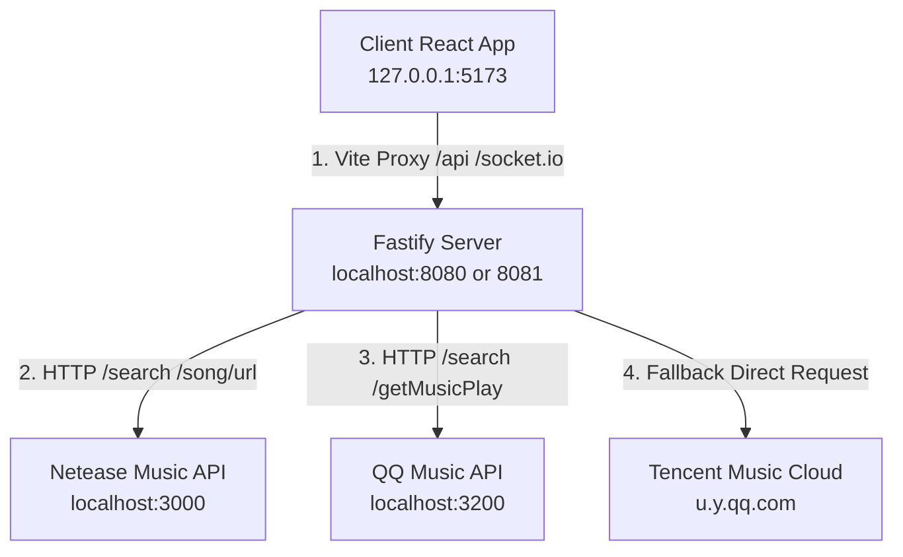

# 🧬 MuseSync 后端架构、REST API 与长连接协议规格书 (Backend Specification)

---

> [!NOTE]
> 本文档是为 **Coding AI Agent** 和**前端重构团队**专门编写的技术规格说明书。包含 MuseSync 双人同步房后端的全部技术连接、HTTP API 规格、Socket.IO 协议定义、核心算法机制以及共享数据结构模型。阅读本篇即可快速对接或重构前端工程。

---

## 1. 系统网络拓扑与端口分配 (Network Topology)

在本地开发与生产部署状态下，项目的网络连接结构如下：



### 端口一览表 (Ports Configuration)
*   **客户端开发服务器 (Vite Client)**: `http://127.0.0.1:5173`
*   **后端 Fastify 主服务**: `http://localhost:8080` (本地 Session 往往被配置为 `PORT=8081`)
*   **网易云音乐 API 服务**: `http://localhost:3000`
*   **QQ 音乐 API 服务**: `http://localhost:3200`

---

## 2. 共享数据模型 (Shared TS Types)

前后端统一基于 `@musesync/shared` TypeScript 包声明通信实体，避免了字段名不吻合的缺陷：

```typescript
// 1. 成员实体模型
export interface Member {
  id: string;            // Socket.id
  nickname: string;      // 昵称（Guest/自定义）
  role: "host" | "guest"; // 角色
  avatar: string;        // 专属头像 Emoji（🎧, 🎵, 🎶, 🎼, 键盘等）
  latency: number;       // 网络时延测定值
  status: "synced" | "disconnected"; // 状态
}

// 2. 音乐轨道数据模型
export interface Track {
  id: string;            // 平台上的原始音轨ID / QQ为songmid
  platform: "netease" | "qq";
  title: string;
  artist: string;
  album: string;
  cover: string;
  duration: number;      // 音频长度（以秒为单位）
  lyrics: Array<{ time: number; text: string }>; // 预解析的歌词行
  sourceUrl?: string;    // 解析出来的第三方 CDN 真实音频直链
  proxyUrl?: string;     // 绕过防盗链的本地 Fastify 代理音频链 `/proxy/audio?url=...`
}

// 3. 房间全局状态模型
export interface RoomState {
  roomId: string;        // 6位大写字母与数字组成的唯一房间ID
  hostId: string;        // 房主 Socket.id
  members: Member[];     // 成员列表（Max 2人）
  track: Track | null;   // 当前选定的音轨
  position: number;      // 当前播放到的进度（毫秒）
  isPlaying: boolean;    // 是否处于播放状态
  lastSyncAt: number;    // 服务端上一次应用同步动作的时间戳（Date.now() 绝对时间）
  queue: Track[];        // 房间等待队列
}
```

---

## 3. HTTP REST API 路由规格书 (REST API Routes)

所有的 API 请求均由客户端通过 `BASE = ''` 相对路径发起。以下是路由定义：

### 3.1 音乐搜索接口 (Search)
*   **路径**：`GET /search`
*   **Query 参数**：
    *   `keyword`: 关键词（歌名 / 歌手）
    *   `platform`（可选）：`netease` 或 `qq`。不传则并行搜索多端。
*   **成功响应**：`{ ok: true, tracks: SearchResult[] }`

### 3.2 音乐解析接口 (Resolve Track)
*   **路径**：`POST /track/resolve`
*   **Body 参数**：`SearchResult` 或 `Track` 格式的实体对象。
*   **功能**：对音轨进行可播放性解析（获取 CDN 链接及歌词），并包装为支持同源代理的 `Track` 返回。
*   **成功响应**：`{ ok: true, track: Track }`

### 3.3 音频字节代理网关 (Audio Proxy)
*   **路径**：`GET /proxy/audio`
*   **Query 参数**：`url`: 第三方音乐 CDN 直链。
*   **重要头支持**：
    *   **HTTP Range 头**：后端完美支持 `request.headers.range` 以传输 `206 Partial Content`，从而全面配合 Howler/浏览器播放器的分段切片拖拽进度功能。
    *   **防盗链绕过**：后端向 CDN 转发时会默认注入 `Referer: https://music.163.com/` 与规范 `User-Agent`。

### 3.4 登录与授权接口 (Auth System)
*   `GET /auth/status`：获取当前网易云/QQ 音乐的 Cookie 绑定状态及账号 Profile。
*   `GET /auth/verify`：连通性验证。
*   `GET /auth/netease/qr`：申请网易云二维码。
*   `GET /auth/netease/qr/check`：检测二维码扫描状态。
*   `POST /auth/netease/cookie` / `POST /auth/qq/cookie`：直接绑定与写入 Cookie 到服务端配置文件。

---

## 4. Socket.IO 房间同步长连接协议 (Real-time Socket.IO Events)

在双人同步房中，长连接通信遵循如下强状态事件机制：

### 4.1 房间基础管理事件

#### [room:create] - 创建房间 (C -> S)
*   **Payload**：`{ nickname?: string }`
*   **响应 (Ack)**：`{ ok: true, room: RoomState }` 或 `{ ok: false, error: string }`

#### [room:join] - 加入房间 (C -> S)
*   **Payload**：`{ roomId: string, nickname?: string, previousMemberId?: string }`
    *   *注：previousMemberId 用于断线重连（容错抢占机制）。*
*   **响应 (Ack)**：`{ ok: true, room: RoomState }` (其中 `room.position` 会采用服务端最新的绝对进度)。
*   **广播事件 (S -> C)**：向房间内其他人广播：`room:member_joined`，Payload 为 `{ member: Member }`。

#### [room:member_left] - 成员离开广播 (S -> C)
*   **触发条件**：Socket 连接断开。
*   **广播内容**：`socket.to(roomId).emit("room:member_left", { memberId: string })`

---

### 4.2 核心播放同步事件 (Play state synchronization)

以下四个事件是由客户端状态发生变化（用户手动点击）时发起的同步动作。通信流程与数据载体高度统一：

| 事件名称 (Event) | 发起端动作 (Action) | Payload (C -> S) | 广播给其他成员 (S -> C) | 服务端执行逻辑 (Server Execution) |
| :--- | :--- | :--- | :--- | :--- |
| **`sync:play`** | 用户点击播放 | `{ roomId, position }` | `{ roomId, position, ts }` | `isPlaying = true`, 刷新 `position` |
| **`sync:pause`** | 用户点击暂停 | `{ roomId, position }` | `{ roomId, position, ts }` | `isPlaying = false`, 固化当前 `position` |
| **`sync:seek`** | 拖动进度条 | `{ roomId, position }` | `{ roomId, position, ts }` | 刷新当前 `position` |
| **`sync:change`** | 点播切歌 | `{ roomId, track }` | `{ roomId, track, ts }` | 绑定新 `track`，`position = 0`，启动播放 |

> [!IMPORTANT]
> **服务端下发的 `ts` 代表该项同步在服务端被确认的绝对毫秒时钟 (`room.lastSyncAt`)**。接收方客户端收到广播后，在执行进度同步时，**必须扣除该广播传输消耗的网络耗时**，从而在本地实现完美的零误差播放。

---

### 4.3 毫秒级高精度延迟测定协议

为了校准时钟偏差，实现“双人完全同步”的播放效果，项目定义了主动延迟测定机制：

```text
Client (t1)                        Server
  |                                  |
  | -------- ping:send { ts: t1 } -> |
  |                                  | (serverTs = T_srv)
  | <------- ping:ack { ts: t1, serverTs: T_srv } - |
  |
Client Receives (t2)
```

1.  **客户端发起 `ping:send`**：传送当前的客户端绝对时间戳 `t1`：`socket.emit("ping:send", { ts: Date.now() })`。
2.  **服务端应答 `ping:ack`**：返回客户端的时间戳 `t1` 加上**服务端当前的绝对时间 `serverTs`**：`socket.emit("ping:ack", { ts: t1, serverTs: roomManager.now() })`。
3.  **客户端计算网络延迟与时钟偏移**：
    *   **单程网络延迟 (Latency)**: $L = \frac{t2 - t1}{2}$
    *   **客户端与服务端时钟的绝对偏移量 (Clock Offset)**: $O = T\_srv - (t1 + L)$
    *   在应用 `/sync:*` 广播的播放进度时，客户端需要应用此绝对偏差值对 Howler 的 `playOffset` 进行微调，从而彻底磨平毫秒级的播放不同步。

---

## 5. 核心后端机制与高可用容错算法 (Core Backend Heuristics)

### 5.1 房间断线防垃圾回收与“身份抢占”机制 (Room Re-claiming)
*   **断线不销毁**：成员断线后，服务端将其 `Member.status` 标记为 `"disconnected"`。只有当**所有成员**全部掉线，服务端才会启动一个 `30分钟` 的垃圾回收定时器。
*   **身份与角色继承**：若在 30 分钟内重连，且客户端送入原本的 Socket ID 作为 `previousMemberId`：
    *   新 Socket ID 会**直接继承**该用户原本的角色（Host 或是 Guest）以及原有的专属头像 Emoji。
    *   如果是 Host 掉线重连，新 Socket 也会自动重夺 `Room.hostId` 所有权，实现最稳健的网络容错表现。

### 5.2 多版权平台自动“无感降级”解析算法 (Platform Fallback)
在 `musicService.ts` 中实现：
*   **搜素去重合并**：并行发起 QQ 与网易云检索，将歌名和歌手通过拼音与 NFKC 归一化归并（标记 `bothPlatforms = true`），将双方的 ID 合二为一。
*   **解析重试 fallback 梯队**：
    1.  优先尝试歌曲主适配器解析（网易云）。
    2.  解析失败，若存在对应的 `qqId`，尝试使用 QQ 音乐适配器解析。
    3.  若依旧失败，**自动拼装 `歌名 歌手` 作为关键字，调用 QQ 音乐官方原生 Vkey 通信端点进行二次模糊检索**。
    4.  对检索出的候选列表进行严密评分（`rankFallbackTracks` 对歌手匹配度、是否有 Live/现场版/伴奏标记打分），找到同音轨的纯净版歌曲，通过 QQ 适配器降级播出。
    *   *该算法突破了平台间的版权藩篱，让前端拥有最广阔的播放版权面。*

---

## 6. 前端重构设计提示词 (Redesign Guidelines for Next Agent)

> [!TIP]
> **在为本项目重新设计 UI/UX 时，下一个 Coding Agent 或前端团队必须注意：**
> 1.  **本地音频代理**：播放器直接播放音轨的 `proxyUrl`，切勿直接请求 `sourceUrl`，以避免跨域和被第三方屏蔽。
> 2.  **毫秒级延迟校准**：本地 Howler 的播放偏移应该结合 `ping` 算出的 `Latency` 与 `Clock Offset` 对同步进度进行补正。
> 3.  **掉线防抖重连**：当 Socket 意外断开时，前端应将当前 Socket ID 临时存在 `localStorage` 中。在 reconnect 成功后，将旧 ID 作为 `previousMemberId` 重新发起 `room:join`，重新夺回 host/guest 的位置。
